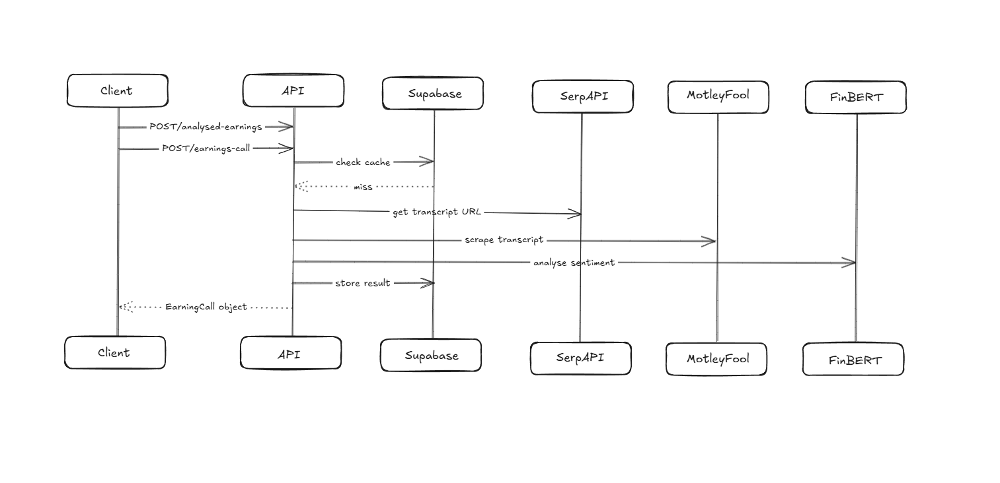

## Setup

**1. `pip install -r requirements.txt`**
**2. Run the API:** `uvicorn api.main:app --reload`

### API Endpoints

- **POST `/analysed-earnings`**
  - Body: `{ "ticker": "AAPL", "quarter": "Q1" }`
  - Returns: full `EarningsCall` object with sentiment.
- **POST `/earning-call`**
  - Body: `{ "ticker": "AAPL", "quarter": "Q1" }`
  - Returns: `EarningsCall` without sentiment (scrape only).

The `transcript` field is returned as a single string.

> [!NOTE]
> This application scrapes transcripts directly from **Motley Fool** (`fool.com`). Therefore, only tickers/quarters with earnings call transcripts published on Motley Fool are supported. If no transcript is found for the requested ticker, the API returns a `500` response: `"No earnings call transcript found for ticker <TICKER>"`.

## Design

##### Sequence Diagram

## Study

### Hypothesis

I wanted to look into whether the sentiment on an earnings call was reflected in the share price movement of stocks following their earnings call.

To do this, I used the publicaly available FinBERT NLP model to analyse the sentiment of financial text, as well as these earning call transcripts (https://www.kaggle.com/datasets/ramssvimala/earning-call-transcripts?select=NLP_Dataset) to return the sentiment of each earning call in the dataset.

To get the earnings call dates

After that, I used the Yahoo Finance API to return the historical price data of each stock in the dataset, and got the price difference over the period I was looking at

### Findings

| Time Period          | Alignment Rate | Correlation |
| -------------------- | -------------- | ----------- |
| **Quarter**    | 53.33%         | 0.00        |
| **+- 5 days** |                |             |

### Interpretation

Quarterly results show weak correlation and an alignment rate between the sentiment score and price return that is no better than a coin flip. This is consistent with the efficient market hypothesis - quarterly returns already account for market expectations formed ahead of the call, diluting the post-call sentiment signal over a 3-month window.

### Analysis Utilities

- `analysis/quarter_returns.py` fetches earnings call dates via the transcript service and computes price returns around the call date.
